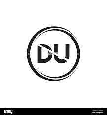
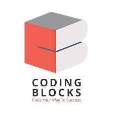
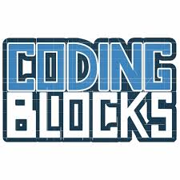

<<<<<<< HEAD
=======
# 💼 Harsh Sisodia's Developer Portfolio

Welcome to my personal developer portfolio! This is a showcase of my skills, projects, and certifications. It includes everything from web development and data science to DSA practice and e-commerce projects.

---

## 🔗 Deployed Link

**[👉 View Portfolio Live](https://github.com/981816H/MY_PORTFOLIO)**  

---

## 🚀 Tech Stack

- **Frontend**: HTML, CSS, JavaScript
- **Frameworks**: React.js (if used)
- **Version Control**: Git & GitHub
- **Tools**: VS Code

---

## 📂 Projects

### 🛍 E-Commerce Website
A modern shopping website interface with cart and product filtering.

### 📊 Data Science Dashboard
Built data visualizations using Python libraries like Pandas, Matplotlib, and Seaborn.

### 🔧 DSA Practice Projects
Implemented DSA problems in Java, with topics including arrays, trees, graphs, and dynamic programming.

---

## 🎓 Education & Certifications

- **BCA Student**, Delhi University 
- **Certifications**:
  - Data Structures in Java - Coding Blocks 
  - Java Developer Track - Coding Blocks 
  - Machine Learning - Coursera 
  - Currently pursuing: BCA from IGNOU 

---

## 👨‍💻 About Me

I'm Harsh Sisodia, an aspiring full-stack developer and data science enthusiast. Passionate about building meaningful web applications and solving real-world problems with code.

---

## 📫 Connect with Me

- GitHub: [@981816H](https://github.com/981816H)
- LinkedIn: *(https://www.linkedin.com/in/harsh-sisodia-aab249288/)*
- Email: *(rajputh322@gmail.com)*

---

## 🖼 Credits

Icons, logos, and illustrations used from:
- [Coding Blocks](https://codingblocks.com)
- [Coursera](https://coursera.org)
- [DU](https://du.ac.in), [IGNOU](https://ignou.ac.in)
- Free image assets for DSA/Data Science/E-Commerce visuals.

---

> “Code your way to success 🚀”
>>>>>>> ddbc270 (update)
